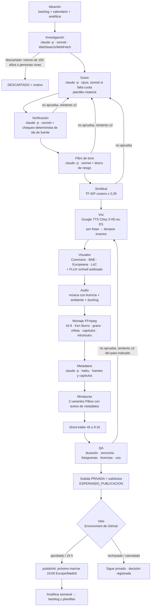
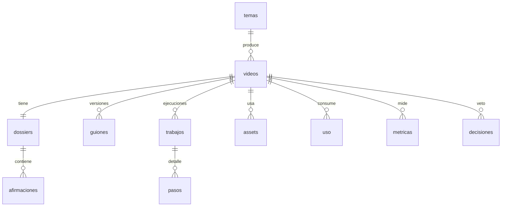

# Arquitectura — Fase 1 (aprobada el 28/09/2026, implementada)

Fecha: 28/09/2026.

**Decisiones de partida** (ver `docs/fase0-informe.md` §9):
- Repositorio público y mercado España (voz es-ES).
- Corte de antigüedad: 100 años.
- Coste 0 €: Claude Pro por CLI, Google Cloud TTS en su capa gratuita, Cloudflare Workers AI
  y archivos de dominio público.
- Python orquesta.

## 1. Principios

1. **Python determinista orquesta; Claude solo escribe.** El pipeline (`python -m src.pipeline`)
   es una máquina de estados con los pasos persistidos en SQLite.
   - Claude interviene en 5 pasos creativos: dossier, guion, verificación, tono y metadatos.
   - Cada uno es una llamada `claude -p` con JSON validado (`--json-schema`), `--max-turns`,
     herramientas mínimas y el prompt del subagente de `.claude/agents/`.
2. **Idempotente y reanudable.**
   - Cada paso tiene una clave de entrada (hash de sus entradas) y un artefacto de salida.
   - Si el artefacto existe y la clave coincide, el paso se salta.
   - Un run fallido se reanuda desde el primer paso incompleto.
3. **Uso en lugar de euros.** Con el plan Pro lo escaso es la cuota de uso de Claude, no el
   dinero. La tabla `uso` registra llamadas, turnos y tokens por paso (salida JSON de
   `claude -p`), además de los caracteres de TTS y las imágenes generadas.
   - Hay límites por vídeo y por semana en la configuración.
   - Si Claude responde con un límite de uso agotado, el vídeo queda `PAUSADO_CUOTA` y se
     reanuda en el siguiente run, sin contar como fallo.
4. **Ningún secreto se lee ni se imprime.** Las credenciales van en variables de entorno o en
   ficheros de `secrets/` que nunca se versionan. El logger las enmascara.

## 2. Pipeline

### Estados de un vídeo

`PENDIENTE → INVESTIGADO → TONO_OK → VOZ_OK → VISUALES_OK → AUDIO_OK → MONTADO →
METADATOS_OK → MINIATURAS_OK → SHORT_OK → QA_OK → ESPERANDO_PUBLICACION → PROGRAMADO → PUBLICADO`.

El tramo guion → similitud → verificación → tono es atómico (`INVESTIGADO → TONO_OK`): si falla un
control se regenera el guion con los motivos como instrucciones. QA retrocede al estado anterior del
paso a rehacer (voz, visuales, montaje o guion).

Estados terminales: `DESCARTADO`, `RECHAZADO_VETO` y `BLOQUEADO` (tras 3 errores seguidos).
`PAUSADO_CUOTA` y `ERROR` son resultados del run, no estados del vídeo: el vídeo conserva su
posición y el siguiente run lo reanuda.

## 3. Módulos (`src/`)

| Módulo | Qué hace | Externo |
|---|---|---|
| `config.py` | Carga y valida `config/canal.yaml` (pydantic) | — |
| `db.py` | Esquema SQLite, migraciones y acceso tipado | — |
| `registro.py` | Logs estructurados JSON en `data/estado/logs/`, con enmascarado de secretos | — |
| `claude_cli.py` | Envoltorio de `claude -p`: modelo, herramientas, `--json-schema`, `--max-turns`, reintentos con backoff, detección de cuota agotada y registro de uso | Claude Pro |
| `ideacion.py` | Elige un tema: prioridad del backlog, calendario, rotación de país y tipo, y señales de analítica | — |
| `investigacion.py` | Dossier en Markdown más JSON de afirmaciones con id, fuente y etiqueta HECHO/LEYENDA/ESPECULACIÓN. Descarta por antigüedad o por personas vivas | Claude (WebSearch/WebFetch) |
| `guion.py` | Guion de 1.800-3.000 palabras con la plantilla asignada (rotación sobre los últimos 5 vídeos). Cada afirmación factual cita `[F:id]` | Claude |
| `verificacion.py` | Chequeo determinista (toda cita `[F:id]` existe en el dossier) más veredicto de Claude sobre las afirmaciones sin marcar | Claude |
| `tono.py` | Léxico de riesgo determinista más puntuación y reescritura de Claude | Claude |
| `similitud.py` | Coseno TF-IDF (n-gramas de palabras y caracteres) contra todos los guiones anteriores | — |
| `tts.py` | Chirp 3 HD es-ES, una petición por frase (tiempos exactos para subtítulos), caché por hash, pausas `[pause]` y pronunciaciones IPA. Interfaz común para poder cambiar a Kokoro o ElevenLabs | Google Cloud TTS |
| `visuales.py` | Busca en la API de Wikimedia Commons (Europeana, BNE y LoC, pendientes para la Fase 3). Descarga, normaliza y registra la licencia. Genera con FLUX solo las escenas sin material, en estilo grabado | Cloudflare Workers AI |
| `audio.py` | Música de `assets/musica/` (manifiesto de licencias), sonido ambiente y ducking con `sidechaincompress` | FFmpeg |
| `montaje.py` | Escenas con zoompan (Ken Burns), transiciones, grano y viñeta, intro y outro de marca, capítulos | FFmpeg |
| `miniaturas.py` | 3 variantes (composición, tipografía y color) | Pillow |
| `metadatos.py` | Título (3 candidatos), descripción con fuentes, capítulos, etiquetas y afiliación | Claude (haiku) |
| `short.py` | Tráiler vertical de 45 s con el gancho y un plano del clímax | FFmpeg |
| `qa.py` | Duración, desfase de subtítulos (≤ 200 ms), 8 fotogramas muestreados (chequeo determinista más revisión visual con Claude), licencias completas y uso | Claude |
| `publicar.py` | `--subir-privado`, `--programar` (`publishAt`) y subida de subtítulos | YouTube Data API |
| `decisiones.py` | Registra aprobaciones y rechazos frente al veredicto automático y calcula la coincidencia | — |
| `analitica.py` | Retención y fuentes de tráfico (YouTube Analytics API) | YouTube Analytics |
| `notificar.py` | Avisos de aprobación, error e informe | Telegram |
| `uso.py` | `--check`: límites de uso por vídeo y por semana | — |
| `auth_youtube.py` | Flujo OAuth local único para generar `secrets/token.json` | Google OAuth |
| `pipeline.py` | Máquina de estados, reanudación y reintentos | — |

## 4. Modelo de datos (SQLite, `data/estado/canal.db`)

| Tabla | Campos clave |
|---|---|
| `temas` | slug, título, país, tipo, época, antigüedad, puntuaciones, prioridad, estado, motivo_descarte |
| `videos` | id, slug, plantilla, estado, youtube_id, publish_at, duración_s, veredicto_auto, creado/actualizado |
| `dossiers` | video_id, ruta, hash, nº_fuentes, lagunas |
| `afirmaciones` | id `F:n`, dossier_id, texto, fuente (autor, obra, año, url), etiqueta |
| `guiones` | video_id, versión, ruta, palabras, plantilla, similitud_max, riesgo_tono, verificación_pct |
| `trabajos` / `pasos` | run_id de GitHub, paso, estado, intento, inicio/fin, error, hash_entrada |
| `assets` | video_id, tipo (imagen/música/sfx/ia), origen, url, autor, licencia, atribución, hash |
| `uso` | video_id, paso, modelo, llamadas, turnos, tokens de entrada y salida, caracteres TTS, imágenes IA |
| `metricas` | video_id, fecha, vistas, retención media, retención por minuto (JSON), fuentes de tráfico |
| `decisiones` | video_id, veredicto_auto, decisión_humana (aprobado/rechazado/cancelado), fecha |

## 5. Modelo por paso (Claude Pro, por CLI)

| Paso | Modelo | Turnos máx. | Herramientas | Motivo |
|---|---|---|---|---|
| Investigación | sonnet | 40 | WebSearch, WebFetch, Read | Muchas lecturas; Sonnet basta y ahorra cuota |
| Guion | opus (fallback sonnet) | 6 | Read | Donde más importa la calidad |
| Verificación | sonnet | 8 | Read | Comparación estructurada |
| Tono | sonnet | 6 | Read | Juicio y reescritura |
| Metadatos | haiku | 3 | Read | Tarea simple |
| QA visual | sonnet | 4 | Read (imágenes) | Revisión de fotogramas |

Prompt caching y la Batch API no aplican (solo existen en la API facturada por tokens).
Si más adelante se pasa a la API, `claude_cli.py` es el único punto que cambia.

**Uso esperado**: unas 6 llamadas y 60-70 turnos por vídeo. Se medirá en la Fase 2 con los
contadores reales de la tabla `uso`. Se empieza con 1 vídeo por semana si la cuota semanal de
Pro va justa.

## 6. Herramientas externas: elección, alternativas y coste

| Necesidad | Elegida (0 €) | Alternativas | Por qué |
|---|---|---|---|
| LLM | Claude Pro por `claude -p` | API de Claude (~2 $/vídeo), Gemini gratis (no disponible en el EEE) | Ya lo pagas; es la vía documentada para CI |
| Voz | Google Chirp 3 HD es-ES (1 M de caracteres/mes gratis) | ElevenLabs (22-99 $/mes, voz clonada), Kokoro o Piper (gratis, peor calidad) | Calidad alta y gratis a este volumen. Interfaz intercambiable |
| Subtítulos | Tiempos por frase del TTS | faster-whisper (alineado local) | Exactos y sin coste de CPU |
| Imágenes de archivo | Wikimedia Commons, Europeana (clave gratuita), BNE, LoC | Getty/Shutterstock (de pago) | Dominio público coherente con "historia documentada" |
| Imágenes IA | FLUX.1 schnell en Cloudflare Workers AI (~200 al día gratis, Apache 2.0) | Google Flow (sin API; gratis solo para uso no comercial), Imagen (de pago) | Automatizable, gratis y con uso comercial |
| Música | YouTube Audio Library y Kevin MacLeod (CC-BY), guardadas en `assets/musica/` | Epidemic Sound (10 $/mes) | Gratis. Se registra la licencia pista a pista |
| Montaje | FFmpeg | Remotion (Node, licencia de empresa según tamaño) | Sin dependencias extra; ya instalado |
| Similitud | TF-IDF local (scikit-learn) | Embeddings por API | Determinista y gratis |
| Orquestación | GitHub Actions (repositorio público) | VPS con systemd (`docker/`) | Gratis. El VPS queda como migración futura |
| Datos | SQLite en la rama `estado` | Postgres | Un solo escritor; suficiente |
| Avisos | Telegram Bot API | Email | Inmediato y gratis |

## 7. Orquestación en GitHub Actions (cambios sobre el kit)

- **`producir.yml`**:
  - El job `producir` instala el CLI de Claude y Python 3.12 y ejecuta
    `python -m src.pipeline --tema "$TEMA"` con `CLAUDE_CODE_OAUTH_TOKEN`. Ya no usa
    `claude-code-action` para producir.
  - La concurrencia pasa a nivel de job (`produccion`), para que la espera del veto no bloquee
    ni cancele otros runs.
  - `aprobar`: job vacío protegido por el Environment `aprobacion` (activo) o
    `publicacion-diferida` (pasivo). No toca el estado, así que su espera no bloquea a nadie.
  - `publicar`: tras la aprobación, fija `publishAt` en el próximo día de publicación a las 19:00
    (Europe/Madrid).
  - `registrar-decision` distingue *success*, *failure* (rechazo) y *cancelled* (veto pasivo).
- **`reparar-fallo.yml`**: se dispara solo si falló el job `producir`, no por un rechazo del
  veto. Usa `claude-code-action@v1` con `claude_code_oauth_token` y `/reparar-fallo`.
- **`informe-semanal.yml`**: igual, con `/informe-semanal`.
- **Permisos de Claude en CI**: `--permission-mode dontAsk` más una lista explícita de
  permitidos en `.claude/settings.json`. Nada de modo `auto` en CI.
- **Crons**: producción los martes a las 06:00 UTC y publicación el viernes a las 19:00. Se pasará a
  martes y viernes cuando se mida la cuota de Pro.
- **Hooks**: las llamadas `claude -p` del pipeline llevan `CANAL_PIPELINE=1`, que desactiva el hook
  Stop (pytest y ruff). El hook de bloqueo de secretos sigue activo.
- **`tests.yml`**: ruff y pytest en cada push a `main` y en cada PR.
- **Secrets nuevos**:
  - `CLAUDE_CODE_OAUTH_TOKEN`
  - `GCP_TTS_SA_JSON` (cuenta de servicio con solo el rol de TTS)
  - `CLOUDFLARE_ACCOUNT_ID` y `CLOUDFLARE_API_TOKEN`
  - `EUROPEANA_API_KEY`
  - `ANTHROPIC_API_KEY` y `ELEVENLABS_*` se retiran.

## 8. Controles de calidad (umbrales en `config/canal.yaml`)

| Control | Implementación | Umbral |
|---|---|---|
| Fuentes | Toda afirmación factual cita un `[F:id]` existente. Claude marca las frases factuales sin cita | 100 % |
| Tono | Léxico de riesgo más la puntuación de Claude (0-10) | ≤ 3 |
| Similitud | Coseno TF-IDF máximo frente a los guiones anteriores | ≤ 0,35 |
| Duración | ffprobe | 720-1200 s |
| Sincronía | Desfase entre el fin de frase del TTS y el subtítulo | ≤ 200 ms |
| Visual | 8 fotogramas: resolución, negros, texto legible y revisión de fotorrealismo | Sin incidencias |
| Licencias | Todo asset tiene origen y licencia | 100 % |
| Uso | Llamadas y turnos de Claude por vídeo | Según configuración |

Si un control falla, se regenera el paso hasta 2 veces. Si vuelve a fallar, el vídeo pasa a
`DESCARTADO` con el motivo y se avisa por Telegram.

## 9. Cambios previstos en el kit (Fase 1)

1. **`CLAUDE.md`**: decisiones, arquitectura resumida y definición de terminado medible
   (pytest y ruff en verde, umbrales de QA, fila en `uso`, `ultimo_resultado.json`).
2. **`config/canal.yaml`**:
   - Nombre, mercado ES y voz es-ES.
   - `contenido.antiguedad_minima_anios: 100`.
   - Bloque `uso` en lugar de `presupuesto`.
   - Fuentes visuales y calendario.
3. **`.claude/agents/`**:
   - Los prompts se convierten en la fuente de los pasos creativos (`claude_cli.py` los lee),
     con herramientas mínimas y `maxTurns`.
   - `montador` y `qa` pasan a ser deterministas: `montador` se elimina y `qa` queda solo para
     la revisión visual.
4. **`.claude/commands/`**:
   - `/nuevo-video` y `/lote-semanal` llaman a `python -m src.pipeline`.
   - `/reparar-fallo` y `/informe-semanal` se ajustan a SQLite y a los nuevos estados.
5. **Hooks**:
   - `python` en lugar de `python3` (funciona en Windows y en Linux).
   - Corrección de la regex de `venv`.
   - Cobertura de Grep y Glob.
   - Tests nuevos, incluido uno que ejecuta el hook como en Windows.
6. **`.claude/settings.json`**: permisos simplificados y lista de permitidos para `dontAsk` en CI.
7. **Workflows**: los cambios de §7.
8. **Docs**: `docs/configurar-github.md` con la GitHub App, `setup-token`, Google Cloud (TTS,
   facturación y alerta de 1 €), Cloudflare, Europeana y repositorio público.
9. **Código**:
   - `src/` completo con tests (pytest) y lint (ruff).
   - `pyproject.toml` y `requirements.txt`.
   - `.env.example` actualizado.
   - Todos los módulos externos tienen simulaciones para que los tests no llamen a servicios
     reales.

## 10. Pasos manuales que tendrás que hacer tú (guiados en `configurar-github.md`)

1. Crear el repositorio **público** en GitHub y subir el kit.
2. `claude update` (necesitas la v2.1.259 o superior) y `claude setup-token`; guardar el
   token como secret.
3. Proyecto de Google Cloud:
   - Activar la facturación (alerta de 1 €).
   - Habilitar Text-to-Speech, YouTube Data v3 y Analytics.
   - Publicar la pantalla OAuth en producción.
   - Solicitar la auditoría de la API.
4. Cuenta gratuita de Cloudflare (token de Workers AI) y clave gratuita de Europeana.
5. Crear el canal y **verificarlo por teléfono**, necesario para miniaturas personalizadas.
6. Bot de Telegram.

## 11. Riesgos abiertos

- **Cuota de Claude Pro**: podría no llegar para 2 vídeos por semana. Mitigación: 1 por semana
  al principio, Opus solo para el guion, pausa y reanudación.
- **YouTube Analytics API**: hay que verificar en la Fase 1 si expone impresiones y CTR. Si no,
  el CTR se leerá a mano o se inferirá.
- **SSML en Chirp 3 HD**: solo en peticiones síncronas; se usan marcas `[pause]` y
  pronunciaciones IPA.
- **Auditoría de la API de YouTube**: hasta que se apruebe, los vídeos quedan privados y se
  publican a mano.
